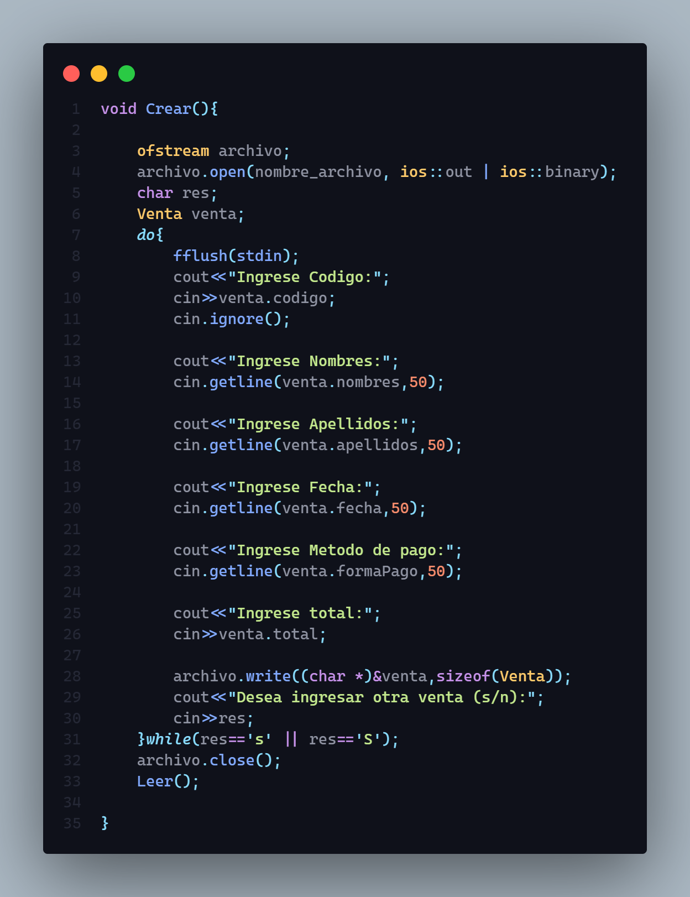
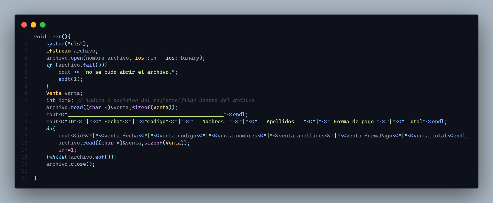
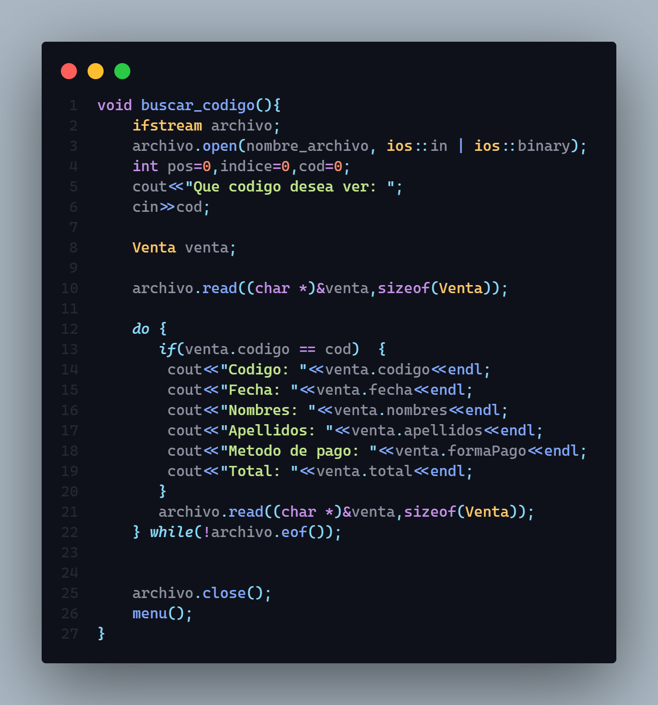
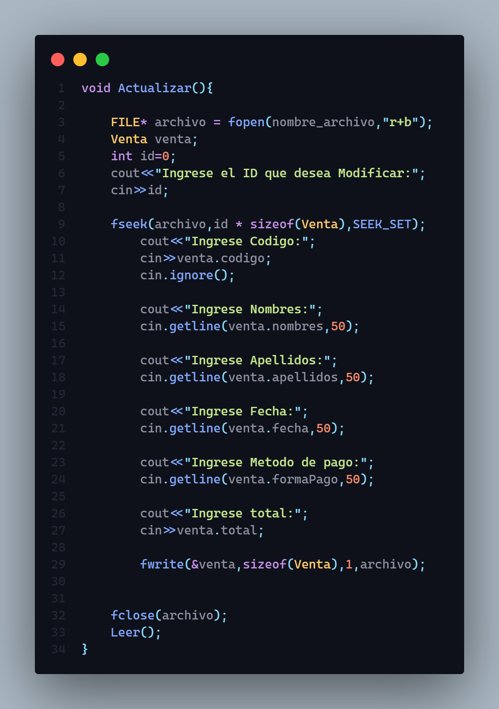
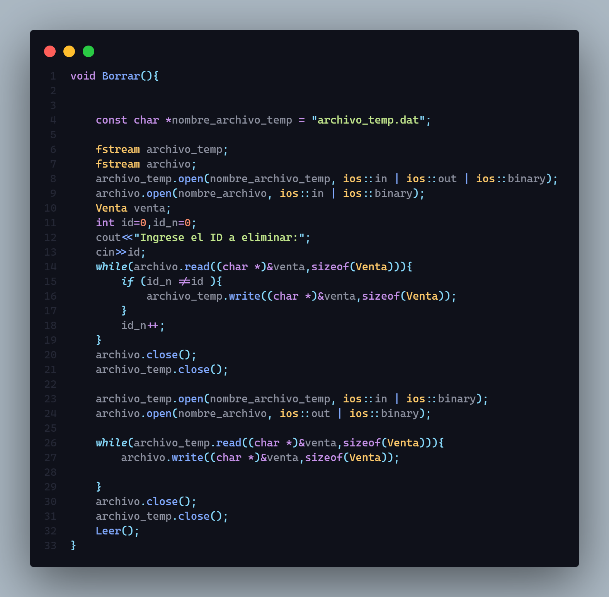

# Proceso de alta

las "altas" se refieren a la operación de crear nuevos registros en una base de datos. Una "alta con integridad" significa que cuando se crea un nuevo registro, se asegura que se cumplan todas las restricciones de integridad referencial, es decir, que los datos relacionales entre las diferentes tablas de la base de datos sean consistentes.

Por ejemplo, si una tabla "Pedidos" tiene una clave foránea "ClienteID" que hace referencia a la tabla "Clientes", una alta con integridad aseguraría que el "ClienteID" en el nuevo registro de pedido existe en la tabla "Clientes". Si no existe, entonces la alta con integridad no permitiría la creación del nuevo registro.

Por otro lado, una "alta sin integridad" no realiza esta verificación y permite que se cree el registro incluso si viola alguna restricción de integridad. Esto puede llevar a datos inconsistentes y problemas en la integridad referencial de la base de datos.;

# Proceso de consulta

## consulta masiva

## consulta particular

En un CRUD, el proceso de consulta se refiere a la operación de recuperar información o registros existentes de una base de datos. La consulta es una de las operaciones más importantes que se realizan en una base de datos, ya que permite a los usuarios obtener información específica de la base de datos en función de ciertos criterios de búsqueda.

En un proceso de consulta típico en un CRUD, un usuario proporciona una consulta o un conjunto de criterios de búsqueda para recuperar los datos deseados. Estos criterios pueden incluir palabras clave, valores de atributos específicos o rangos de fechas, entre otros. La consulta se envía a la base de datos y se ejecuta para recuperar los registros que coinciden con los criterios de búsqueda.

La respuesta de la consulta se devuelve al usuario en forma de un conjunto de resultados que pueden incluir valores de atributos específicos, registros completos o estadísticas resumidas. En algunos casos, la consulta puede incluir también funciones de agregación como sumas, promedios o conteos para generar informes o estadísticas adicionales.

En resumen, el proceso de consulta en un CRUD es esencial para recuperar información existente de una base de datos y permitir a los usuarios realizar análisis y tomar decisiones basadas en los datos recuperados.

# Proceso de modificacion

En un CRUD, el proceso de modificación se refiere a la operación de actualizar o modificar registros existentes en una base de datos. Este proceso es una de las operaciones más comunes que se realizan en una base de datos y es fundamental para mantener la integridad y la consistencia de los datos en el tiempo.

En un proceso de modificación típico en un CRUD, un usuario identifica un registro existente que necesita ser actualizado. Luego, realiza los cambios necesarios en los valores de los atributos del registro, como agregar, actualizar o eliminar información específica.

Una vez que se han realizado los cambios, el usuario envía la solicitud de modificación a la base de datos. La base de datos procesa la solicitud y actualiza el registro correspondiente con los nuevos valores. Es importante destacar que la modificación de registros en una base de datos debe realizarse con precaución y con un control adecuado, para evitar la corrupción de los datos.

El proceso de modificación también puede incluir restricciones de integridad referencial, lo que significa que si la modificación del registro afecta a otros registros relacionados en la base de datos, estas restricciones garantizan que los cambios no violen las relaciones entre los registros y que la integridad de la base de datos se mantenga.

En resumen, el proceso de modificación en un CRUD es fundamental para mantener la integridad y la consistencia de los datos en la base de datos, y permite a los usuarios actualizar la información existente y garantizar que la base de datos refleje con precisión el estado actual de los datos.

# Proceso de baja

En un CRUD, el proceso de baja se refiere a la operación de eliminar registros existentes de una base de datos. Este proceso es una de las operaciones más comunes que se realizan en una base de datos y es fundamental para mantener la integridad y la consistencia de los datos en el tiempo.

En un proceso de baja típico en un CRUD, un usuario identifica un registro existente que necesita ser eliminado. Luego, envía la solicitud de eliminación a la base de datos. La base de datos procesa la solicitud y elimina el registro correspondiente de la base de datos.

La baja en un CRUD puede ser de dos tipos: baja lógica y baja física.

La baja lógica se refiere a la eliminación de un registro de una base de datos de manera lógica, es decir, sin eliminar físicamente el registro de la base de datos. En este caso, el registro se marca como eliminado o inactivo, pero todavía se mantiene en la base de datos para mantener la integridad de los datos y la consistencia de la base de datos. El registro eliminado lógicamente se puede restaurar en el futuro, si es necesario, y es útil para mantener el historial de cambios en la base de datos.

Por otro lado, la baja física se refiere a la eliminación física de un registro de una base de datos. En este caso, el registro se elimina completamente de la base de datos y no se puede recuperar posteriormente. La baja física puede ser útil en situaciones donde el registro es innecesario o ya no se requiere para mantener la integridad y la consistencia de la base de datos.

Es importante tener en cuenta que, aunque la baja lógica puede ser útil para mantener el historial de cambios y mantener la integridad de la base de datos, también puede tener un impacto negativo en el rendimiento y la capacidad de almacenamiento de la base de datos a largo plazo. Por esta razón, es importante considerar cuidadosamente cuándo usar la baja lógica y cuándo usar la baja física en un sistema CRUD.

# Manual de usuario

[Manual de Usuario](https://ubp.sharepoint.com/:w:/r/sites/PP-022022A-Ing.Informtica2014/Student%20Work/Working%20files/Alessandro%20Chiavarino/TAREA%20PARCIAL%203%20-%20FINAL/Manual%20de%20usuario%20Sistema%20de%20Supermercado.docx?d=wb876ac21d90640a89e21a1dc977ab49e&csf=1&web=1&e=UqufnV)